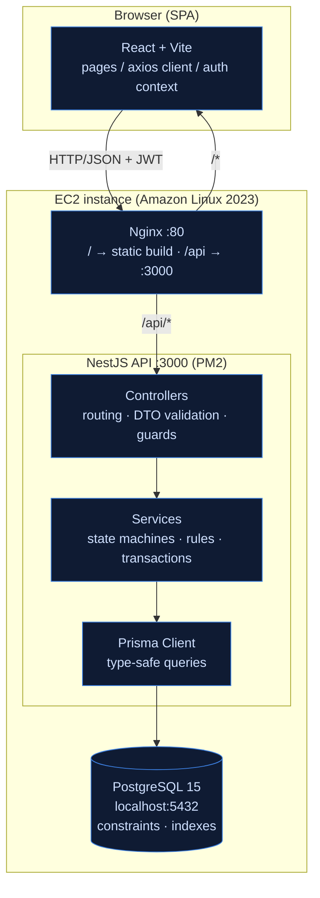
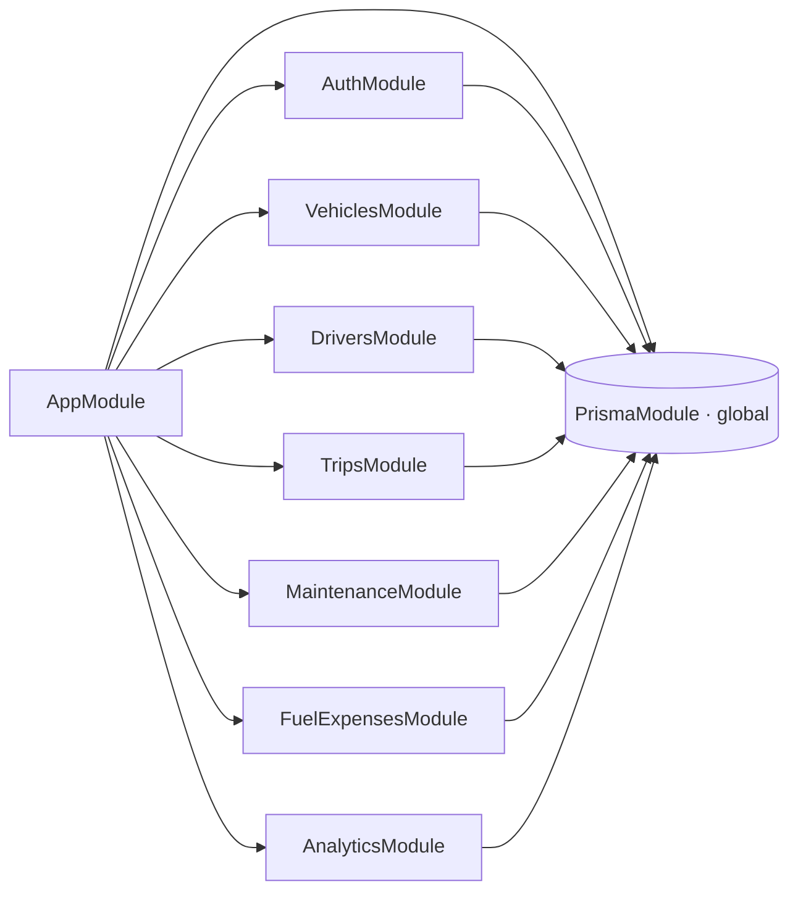
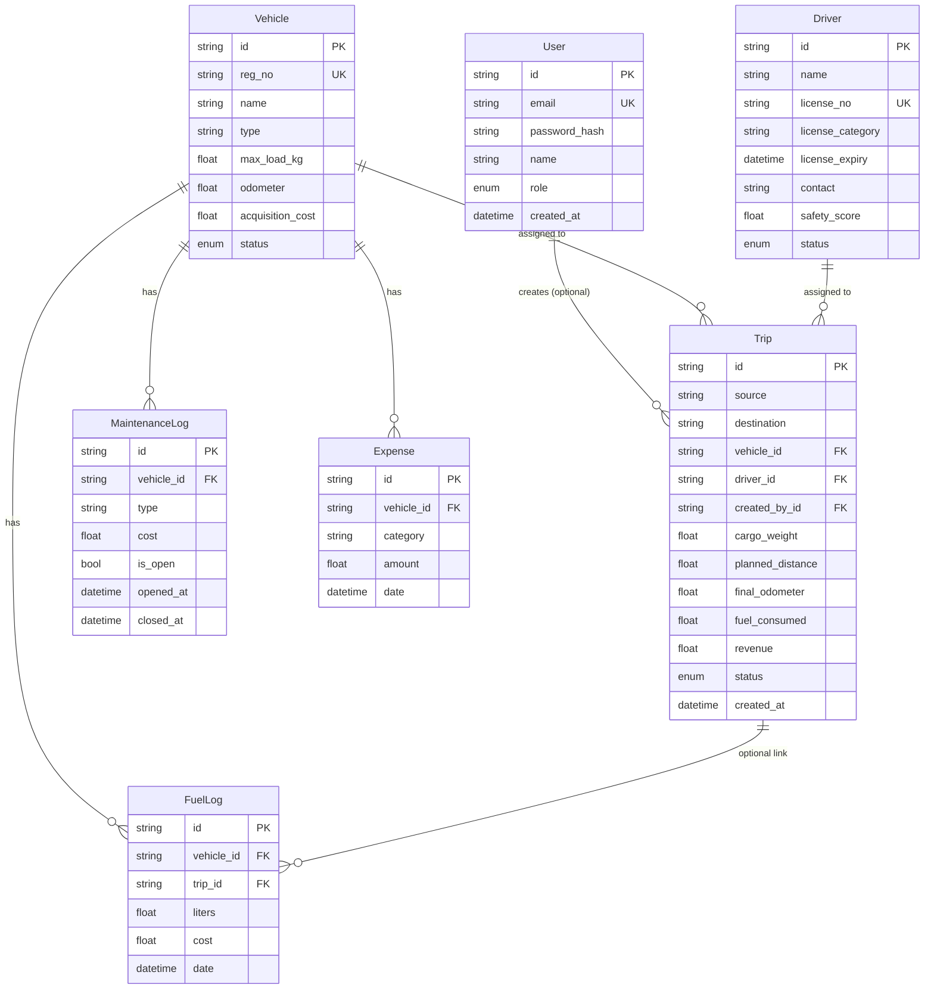
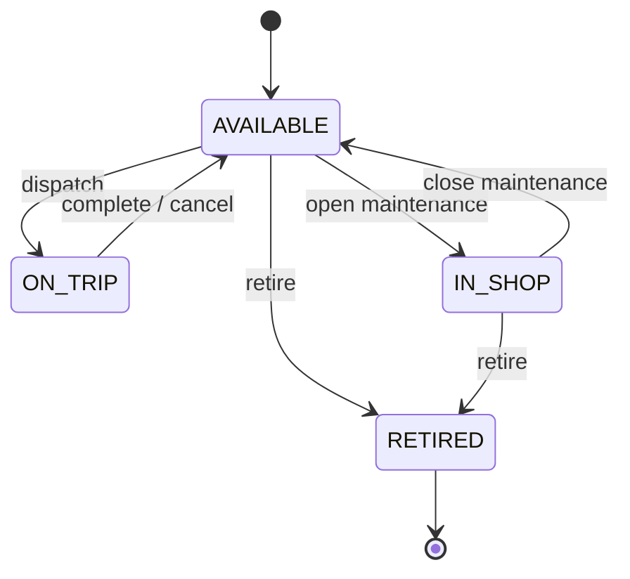
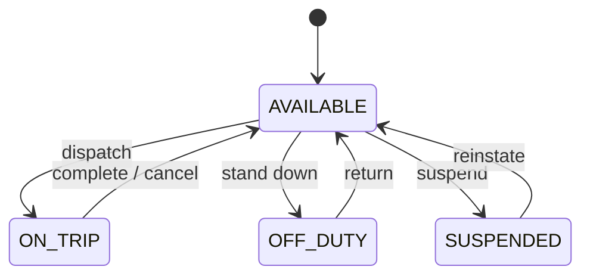
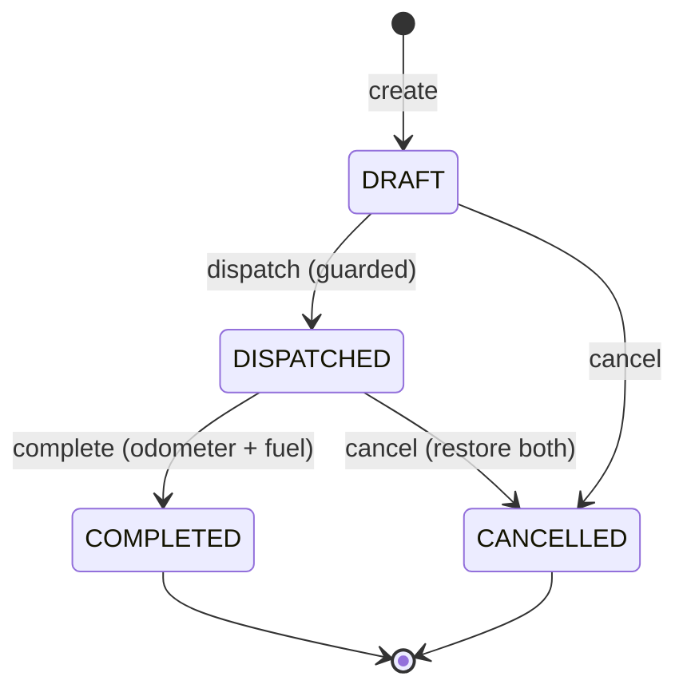
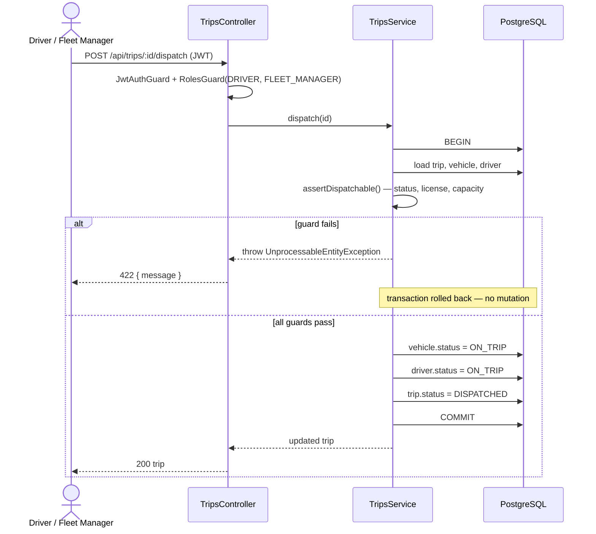
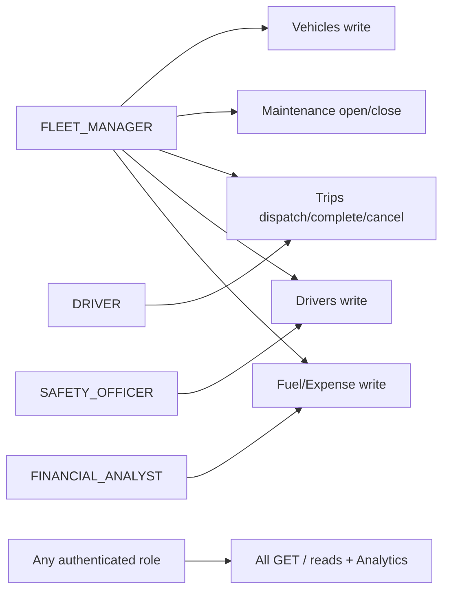
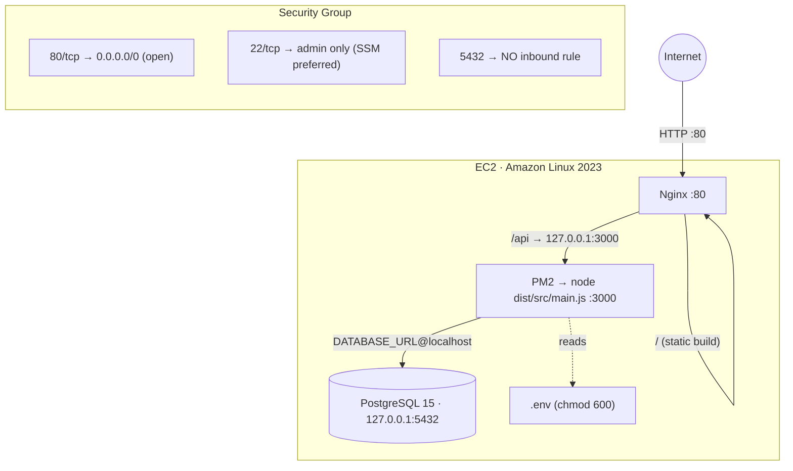
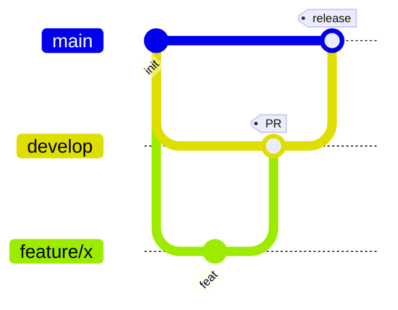

# TransitOps — Technical Architecture

> Smart Transport Operations Platform — a single system of record for the full
> lifecycle of transport operations: vehicle registry, driver management, trip
> dispatch, maintenance, fuel/expense tracking, and analytics — with business
> rules and RBAC enforced by the service layer, not by human discipline.

This document describes the **as-built** system: a NestJS + Prisma + PostgreSQL
backend and a React (Vite) frontend, deployed on a single Amazon EC2 instance
behind Nginx. It is the authoritative reference for engineers working on the
codebase.

---

## 1. Overview

| Concern | Choice |
|---------|--------|
| Frontend | React 19 + TypeScript + Vite, Tailwind CSS, react-router, axios |
| API / business logic | NestJS 10 (module → controller → service) |
| Data access | Prisma ORM 5 (schema-first, type-safe, parameterized) |
| Database | PostgreSQL 15 (localhost-only) |
| Auth | JWT (Passport) + bcrypt password hashing |
| Process manager | PM2 |
| Reverse proxy | Nginx (`/` → SPA build, `/api` → NestJS :3000) |
| Host | Single EC2 instance (Amazon Linux 2023), HTTP |

**Live:** `http://3.110.169.152` — SPA at `/`, REST API at `/api`.

**Separation guarantees**
- No SQL in the UI — the frontend only talks REST over JSON + JWT.
- No business rules in controllers — controllers validate DTOs + delegate to services.
- No raw SQL in services — data access goes through Prisma.

---

## 2. System architecture (layered)



Request flow: the browser calls `/api/...` on the same origin; Nginx reverse-proxies
to NestJS (which owns the global `/api` prefix). Controllers authenticate (JwtAuthGuard),
authorize (RolesGuard), and validate (class-validator DTOs), then delegate to services.
Services hold all domain logic and run multi-entity mutations inside Prisma transactions.

---

## 3. Module structure

```text
server/
├── prisma/
│   ├── schema.prisma            # entities, enums, indexes, relations
│   ├── migrations/              # 20260712000000_init/migration.sql
│   └── seed.ts                  # 4 RBAC demo users + sample fleet data
└── src/
    ├── main.ts                  # /api prefix, ValidationPipe, filter, CORS
    ├── app.module.ts            # wires all modules + global ThrottlerGuard
    ├── prisma/                  # PrismaModule (global) + PrismaService
    ├── common/
    │   ├── decorators/          # @Roles, @CurrentUser
    │   ├── dto/                 # PaginationDto + buildOrderBy + PaginatedResult
    │   ├── filters/             # AllExceptionsFilter (status-code mapping)
    │   └── guards/              # JwtAuthGuard, RolesGuard
    └── modules/
        ├── auth/                # login, /me, JWT strategy
        ├── vehicles/            # registry CRUD + status machine
        ├── drivers/             # profiles + license validity
        ├── trips/               # dispatch engine (core rules) + unit tests
        ├── maintenance/         # open → IN_SHOP / close → AVAILABLE
        ├── fuel-expenses/       # fuel logs + expenses + cost rollups
        ├── analytics/           # KPIs + CSV export
        └── health/              # DB liveness probe
```

Each module owns its own routes, controller, service, and DTOs — matching the
"each module owns its routes/controllers/services/models" rubric.



---

## 4. Database design

### 4.1 Entity–relationship diagram



### 4.2 Constraints & integrity

| Constraint | Purpose |
|-----------|---------|
| `UNIQUE(users.email)`, `UNIQUE(vehicles.reg_no)`, `UNIQUE(drivers.license_no)` | No duplicates (violation → `422`). |
| FK `trips.vehicle_id/driver_id` `ON DELETE RESTRICT` | Prevent orphaned trips. |
| FK `fuel_logs/expenses/maintenance_logs.vehicle_id` `ON DELETE CASCADE` | Clean child rollup when a vehicle is removed. |
| FK `fuel_logs.trip_id` `ON DELETE SET NULL` | Optional trip link. |
| Enums on every `status`/`role` | Only valid states persist. |

### 4.3 Indexes

`vehicles(status)`, `drivers(status)`, `trips(status)` (dashboard/dispatch filters),
`users(email)` unique lookup, `drivers(license_expiry)` (expiry reminders),
`fuel_logs(vehicle_id)`, `expenses(vehicle_id)`, `maintenance_logs(vehicle_id)`,
`maintenance_logs(is_open)` (cost rollups + open-record queries),
`trips(vehicle_id)`, `trips(driver_id)`.

### 4.4 Enumerations

- **Vehicle.status:** `AVAILABLE | ON_TRIP | IN_SHOP | RETIRED`
- **Driver.status:** `AVAILABLE | ON_TRIP | OFF_DUTY | SUSPENDED`
- **Trip.status:** `DRAFT | DISPATCHED | COMPLETED | CANCELLED`
- **User.role:** `FLEET_MANAGER | DRIVER | SAFETY_OFFICER | FINANCIAL_ANALYST`

### 4.5 Migrations

The schema is versioned as a Prisma migration (`prisma/migrations/20260712000000_init`).
`prisma migrate deploy` applies pending migrations on deploy. An existing database that
was previously created with `prisma db push` is **baselined** with
`prisma migrate resolve --applied 20260712000000_init` (marks the migration applied
without re-running it — no data loss), after which all future changes go through migrations.

---

## 5. State machines

### 5.1 Vehicle



### 5.2 Driver



### 5.3 Trip



---

## 6. Business rules (service layer, inside transactions)

| Rule | Enforcement |
|------|-------------|
| Registration / license / email unique | DB unique constraint → `422`. |
| Retired / In-Shop vehicles never dispatch | Dispatch pool filters `status = AVAILABLE`. |
| Expired-license or SUSPENDED driver cannot be assigned | Guard in `TripsService.assertDispatchable()`. |
| Vehicle/driver already `ON_TRIP` cannot be reassigned | Guard checks current status. |
| Cargo weight ≤ vehicle max load | Guard before dispatch. |
| Dispatch → vehicle **and** driver `ON_TRIP` | Single Prisma transaction. |
| Complete → both back to `AVAILABLE`, record odometer + fuel | Single transaction. |
| Cancel dispatched trip → restore both | Single transaction. |
| Open maintenance → vehicle `IN_SHOP` | Side effect in `MaintenanceService.open()`. |
| Close maintenance → vehicle `AVAILABLE` (unless RETIRED) | Side effect in `MaintenanceService.close()`. |

**Key decision:** every multi-entity transition (`dispatch`, `complete`, `cancel`,
`openMaintenance`, `closeMaintenance`) runs in one `prisma.$transaction` so vehicle,
driver, and trip states can never diverge.

### 6.1 Dispatch sequence



---

## 7. API reference

All routes are under the global `/api` prefix. List endpoints support
`?page&limit&q&sort` plus resource-specific filters. All write endpoints validate
class-validator DTOs; all (except login) require a Bearer JWT.

```text
POST   /api/auth/login                 → { accessToken, user }   (throttled 5/min)
GET    /api/auth/me

GET    /api/vehicles      ?page&limit&status&type&q&sort
POST   /api/vehicles                   [FLEET_MANAGER]
GET    /api/vehicles/:id
PATCH  /api/vehicles/:id               [FLEET_MANAGER]
DELETE /api/vehicles/:id               [FLEET_MANAGER]

GET    /api/drivers       ?page&limit&status&q&sort
POST   /api/drivers                    [SAFETY_OFFICER, FLEET_MANAGER]
PATCH  /api/drivers/:id                [SAFETY_OFFICER, FLEET_MANAGER]
DELETE /api/drivers/:id                [SAFETY_OFFICER, FLEET_MANAGER]

GET    /api/trips         ?page&limit&status&vehicleId&driverId
POST   /api/trips                      [DRIVER, FLEET_MANAGER]  # DRAFT
POST   /api/trips/:id/dispatch         [DRIVER, FLEET_MANAGER]
POST   /api/trips/:id/complete         [DRIVER, FLEET_MANAGER]
POST   /api/trips/:id/cancel           [DRIVER, FLEET_MANAGER]

GET    /api/maintenance   ?page&limit&vehicleId&isOpen
POST   /api/maintenance                [FLEET_MANAGER]          # → IN_SHOP
POST   /api/maintenance/:id/close      [FLEET_MANAGER]          # → AVAILABLE

GET    /api/fuel-logs     ?page&limit&vehicleId
POST   /api/fuel-logs                  [FINANCIAL_ANALYST, FLEET_MANAGER]
GET    /api/expenses      ?page&limit&vehicleId&q
GET    /api/expenses/rollup            ?vehicleId
POST   /api/expenses                   [FINANCIAL_ANALYST, FLEET_MANAGER]

GET    /api/analytics/kpis
GET    /api/analytics/reports          ?format=csv|json
GET    /api/health
```

### 7.1 KPI formulas (analytics)

- **Fleet Utilization %** = `ON_TRIP vehicles / operational (non-RETIRED) vehicles × 100`
- **Fuel Efficiency** = `Σ completed-trip distance / Σ completed-trip fuel`
- **Operational Cost** = `Σ fuel cost + Σ maintenance cost`
- **Vehicle ROI** = `(revenue − (maintenance + fuel)) / acquisition cost`

---

## 8. Validation & error handling

DTOs use `class-validator`; a global `ValidationPipe` runs with
`whitelist + forbidNonWhitelisted + transform`. A global `AllExceptionsFilter`
maps errors to status codes:

| Situation | Status |
|-----------|--------|
| Invalid input (DTO) | `400 Bad Request` |
| Missing/invalid token | `401 Unauthorized` |
| Role not permitted | `403 Forbidden` |
| Unknown ID (`P2025`) | `404 Not Found` |
| Business-rule violation / unique constraint (`P2002`, `P2003`) | `422 Unprocessable Entity` |
| DB unavailable (`P1001`/init errors) | `503 Service Unavailable` |

Error body: `{ statusCode, error, message, path, timestamp }`.

---

## 9. Security & RBAC

- **Passwords** hashed with bcrypt (`password_hash`, never plaintext).
- **JWT** auth (`Authorization: Bearer`), 12h expiry; secret from `.env`.
- **RBAC** via `RolesGuard` + `@Roles()`; reads open to any authenticated user, writes role-scoped.
- **SQL injection** prevented by Prisma parameterization; **DTO whitelisting** strips unknown fields.
- **CORS** locked to the instance origin (`CORS_ORIGIN`).
- **Rate limiting** via `@nestjs/throttler` (global 100/min; login 5/min).
- **Secrets** in `.env` on the instance (`chmod 600`), never committed.
- **PostgreSQL** bound to `127.0.0.1` — no inbound security-group rule for 5432.

### 9.1 RBAC matrix



| Capability | FLEET_MANAGER | DRIVER | SAFETY_OFFICER | FINANCIAL_ANALYST |
|-----------|:---:|:---:|:---:|:---:|
| Read everything | ✓ | ✓ | ✓ | ✓ |
| Vehicles write | ✓ | | | |
| Drivers write | ✓ | | ✓ | |
| Trips dispatch/complete/cancel | ✓ | ✓ | | |
| Maintenance open/close | ✓ | | | |
| Fuel / Expense write | ✓ | | | ✓ |

### 9.2 Demo credentials (seeded)

| Role | Email | Password |
|------|-------|----------|
| Fleet Manager | `manager@transitops.io` | `manager123` |
| Driver | `driver@transitops.io` | `driver123` |
| Safety Officer | `safety@transitops.io` | `safety123` |
| Financial Analyst | `finance@transitops.io` | `finance123` |

The login screen preselects the matching email + password when a role is chosen.

---

## 10. Deployment topology



**Provisioning & deploy** are scripted (`deploy/`), driven over AWS SSM (`ssm.ps1`):

1. `10-provision.sh` — Node 20 (official tarball), PM2, PostgreSQL 15, DB + role,
   `pg_hba.conf` set to `scram-sha-256` for localhost TCP.
2. `push-app.ps1` — upload `server/` source, `npm install`, `prisma generate`, `nest build`.
3. `deploy-app.sh` — `prisma migrate deploy` (baseline if needed) → `seed` → PM2 start.
4. `nginx-verify.sh` — write Nginx config (`/` + `/api`), reload, smoke-test.
5. `push-web.ps1` — build + chunked-upload the SPA to `/usr/share/nginx/html`.

---

## 11. Testing

- **Unit tests** — `TripsService` dispatch guards + transactional transitions
  (`server/src/modules/trips/trips.service.spec.ts`, 17 cases): cargo capacity,
  expired license, suspended/on-trip driver, retired/in-shop vehicle, and
  complete/cancel side effects (asserting no mutation on guard failure).
- **Build gates** — `nest build` (API) and `tsc -b && vite build` (web) must pass.
- **Live verification** — health, per-role login, RBAC 403, dispatch 422 guards,
  and confirmation that port 5432 is not internet-reachable.

---

## 12. Git workflow



Feature branches open a PR into `develop`; `develop` merges into `main` for release.
Conventional commits (e.g. `feat(trips): enforce cargo capacity on dispatch`).

---

## 13. Frontend architecture

- **axios client** (`src/lib/api.ts`) — same-origin `/api`; request interceptor attaches
  the Bearer token; response interceptor clears the token and redirects to `/login` on 401.
- **Auth context** (`src/lib/auth.tsx`) — `login/logout`, token persisted in
  `localStorage`, session hydrated via `/auth/me`; `RequireAuth` guards the app shell.
- **Pages** — Dashboard (KPIs + recent trips), Vehicles & Drivers (CRUD with
  pagination/filter/search + modals), Trips (create → dispatch → complete/cancel),
  Maintenance (open/close), Fuel & Expenses (logs + rollups), Analytics (KPIs + CSV export).
  Every data view has explicit loading / empty / error states; write actions are
  RBAC-gated in the UI and re-checked by the API.
